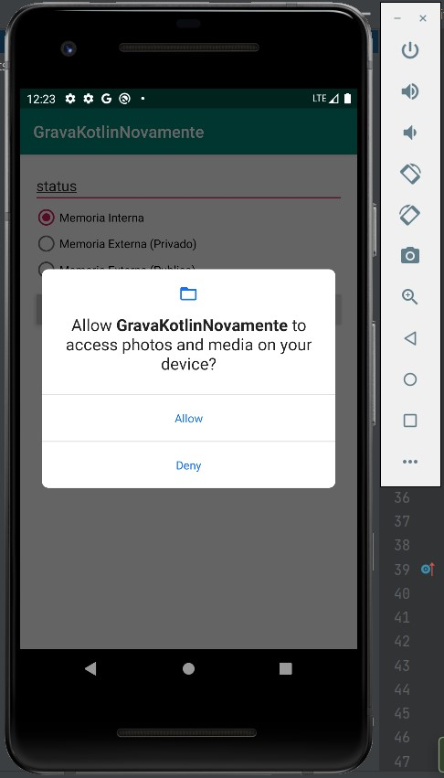

# GravaKotlinNovamente

## Sobre

O projeto é uma aplicação de  

## Informações adicionais

O projeto foi criado com a         

## Layout mobile

     
    
    
      
     

         

## Como execultar o projeto
